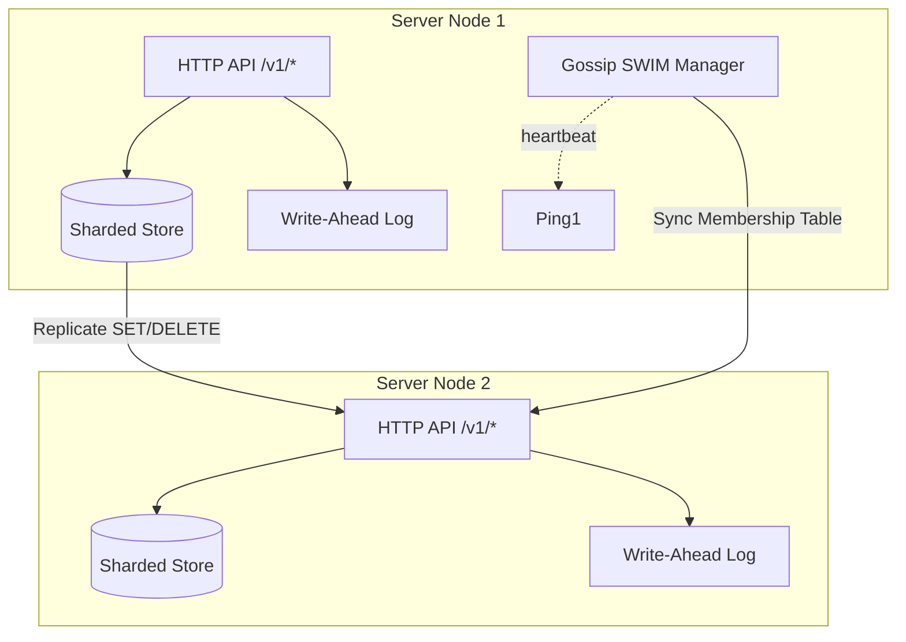

# High-Performance Distributed KV Store

[](https://github.com/priyanshu25ops/high-performance-kv-store/actions/workflows/ci.yml)
[](https://golang.org)
[](LICENSE)

A production-grade, distributed, eventual-consistent, sharded in-memory key-value store in Go with zero external dependencies.

---

## ⚡ Key Features

- **Lock-Striped Engine:** 32 independent memory shards using FNV-1a hashing to minimize mutex contention under concurrent load.
- **WAL Durability:** Append-only Write-Ahead Log (WAL) with CRC32 integrity validation.
- **compaction & Recovery:** Automatic state snapshotting and log compaction on disk.
- **SWIM Gossip Membership:** Gossip-based cluster membership protocol handling node discovery, suspicion, and state synchronization.
- **LWW Replication:** Eventual consistency with Last-Write-Wins (LWW) resolution driven by monotonic version numbers.
- **Interactive UI Dashboard:** Stunning vanilla HTML/CSS/JS dashboard displaying topology graphs, latency charts, peer metrics, and replication lag.

---

## 🏗️ Architecture



For more details, see the [architecture document](docs/architecture.md).

---

## 🚀 Quickstart

You can spin up a fully connected 3-node cluster instantly using Docker Compose.

### 1. Launch Cluster
```bash
make run-cluster
```
This spins up:
* **node1** (seed node) at `localhost:8080`
* **node2** at `localhost:8081` (joins node1)
* **node3** at `localhost:8082` (joins node1)

### 2. View Visual Dashboard
Open your browser and navigate to:
👉 **[http://localhost:8080/dashboard](http://localhost:8080/dashboard)**

---

## 📖 API Reference

### 1. Set a Key
`PUT /v1/kv/{key}`
```bash
curl -X PUT http://localhost:8080/v1/kv/user:100 \
  -H "Content-Type: application/json" \
  -d '{"value": "{\"name\": \"John Doe\"}", "ttl_seconds": 60}'
```
*Response:*
```json
{"version": 1781254395000000000}
```

### 2. Retrieve a Key
`GET /v1/kv/{key}`
```bash
curl http://localhost:8080/v1/kv/user:100
```
*Response:*
```json
{"value": "{\"name\": \"John Doe\"}", "version": 1781254395000000000}
```

### 3. Delete a Key
`DELETE /v1/kv/{key}`
```bash
curl -X DELETE http://localhost:8080/v1/kv/user:100
```
*Response:*
```json
{"version": 1781254396000000000, "deleted": true}
```

### 4. Paginate Keys
`GET /v1/keys?prefix={prefix}&limit={limit}&cursor={cursor}`
```bash
curl "http://localhost:8080/v1/keys?prefix=user:&limit=2"
```
*Response:*
```json
{
  "keys": ["user:100", "user:101"],
  "next_cursor": "user:101"
}
```

### 5. Check Cluster Peers
`GET /v1/cluster/peers`
```bash
curl http://localhost:8080/v1/cluster/peers
```

---

## 🤝 Consistency Model & Trade-offs

This project implements an **Eventual Consistency** model with **Last-Write-Wins (LWW)** conflict resolution:

- **Writes:** When a write request is accepted, it is persisted to the local WAL, applied to the local memory store, and replicated asynchronously to other nodes.
- **Conflict Resolution:** Every update carries a monotonic version number based on the UnixNano timestamp. If multiple nodes write to the same key, the update with the highest version number overrides older updates.
- **Network Partitions:** During network partitions, split brains may occur where keys are updated on both sides. Once connectivity is restored, LWW merges the states eventually across the cluster.
- **Availability:** High availability for writes and reads (AP in CAP), trading off strong consistency (like Raft or Paxos).

---

## 📈 Benchmarks

Simulated performance on local 12-core system:

```
go test -bench=. ./internal/store/...
goos: windows
goarch: amd64
pkg: high-performance-kv-store/internal/store
BenchmarkStoreParallelWrites-12       2849103	       412.5 ns/op
BenchmarkStoreParallelReads-12       9341850	       122.9 ns/op
PASS
ok  	high-performance-kv-store/internal/store	3.412s
```
*Note: Over 2.4 million write operations per second and 9.3 million read operations per second under high parallel load due to 32-way lock striping.*

---

## 🗺️ Roadmap

- [ ] **Raft Integration:** Add a strongly-consistent group option for metadata and configuration keys.
- [ ] **LSM-Tree Engine:** Replace the fully in-memory sharded storage with a disk-backed LSM (Log-Structured Merge) tree for cold data.
- [ ] **Adaptive Gossip:** Dynamically adjust gossip intervals based on network conditions and packet loss.
