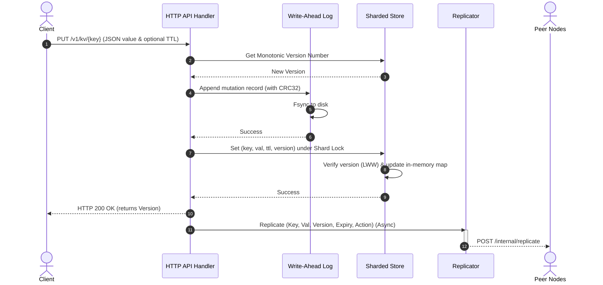
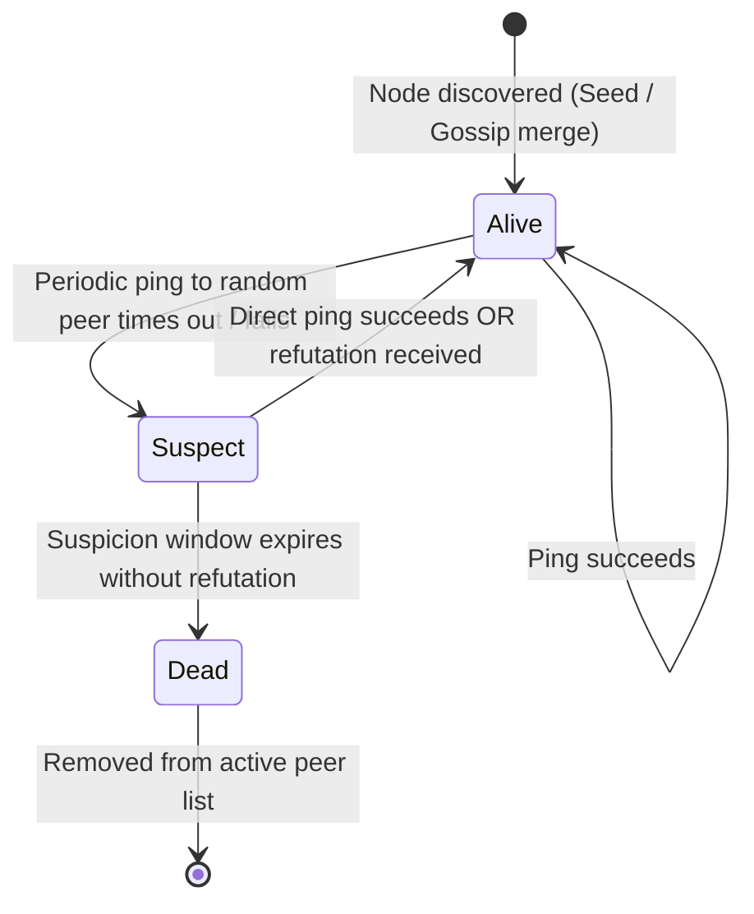

# Architecture & System Design

This document details the internal design of the Distributed Key-Value Store.

## 1. Write Path & Persistence

When a write (PUT or DELETE) is received by a node, it goes through the following sequence:



---

## 2. Gossip Membership Protocol (SWIM-inspired)

Peer discovery and health tracking are managed via periodic SWIM-inspired gossip:



### Gossip Loop Details:
1. **Periodic Tick:** Every node selects a random peer from its list and sends a `GET /internal/ping`.
2. **State Merge:** The recipient responds with its full peer directory. The caller merges this directory using the state precedence `Dead > Suspect > Alive`.
3. **Bootstrapping:** New nodes join by sending a ping to the configured seed node, immediately downloading the entire active peer list.

---

## 3. Asynchronous Replication (LWW)

Updates are replicated asynchronously across the cluster. If different updates for the same key arrive out of order, the conflict is resolved using Last-Write-Wins (LWW):

```mermaid
flowchart TD
    A[Replicate Request received] --> B{Does key exist locally?}
    B -- No --> C[Apply mutation and write to local WAL]
    B -- Yes --> D{Is incoming version >= local version?}
    D -- Yes --> E[Overwrite in-memory & append local WAL]
    D -- No --> F[Discard update (Older write - Out of order)]
    C --> G[HTTP 200 OK]
    E --> G
    F --> G
```
